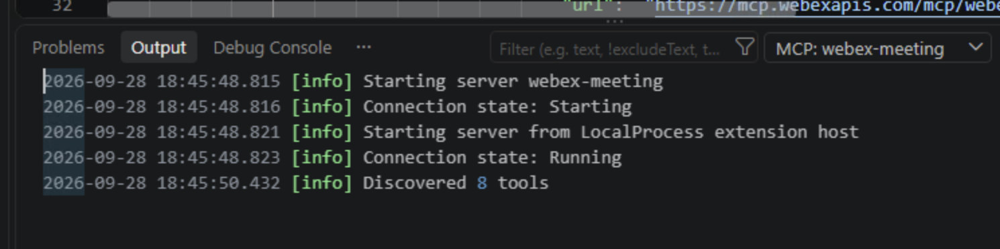
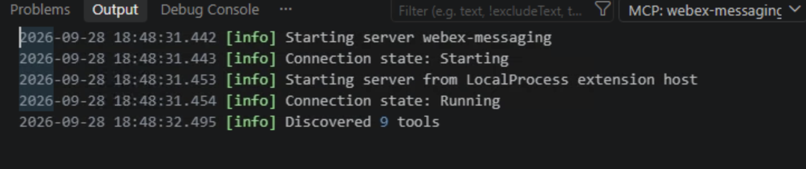
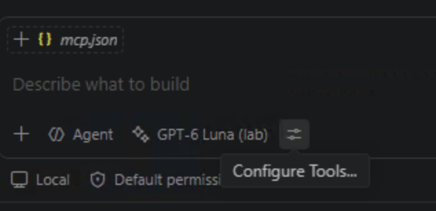

# Lab 1 - Enable Webex MCP in Control Hub

!!! note "Time: 5-25 min"
    Allow the official Webex Meetings and Messaging Agentic Apps, choose their tools, then generate tokens and start their preconfigured VS Code connections.

## Section 1 - Enable the Agentic Apps

In the browser **inside the lab desktop**, sign in at [admin.webex.com](https://admin.webex.com/){:target="_blank"} with the **Control Hub administrator** email and password in **Session_Info.txt**. The Webex App user may have different credentials. If a cookie notice appears, choose your preferred option and continue; the screenshots may not show that notice.

### Enable the Webex Meeting app

1. Sign in to [admin.webex.com](https://admin.webex.com/){:target="_blank"} with the lab administrator account.
2. Open **Apps → Agentic Apps → Webex**.
3. Locate the **Webex Meeting** agentic app.
4. Open the app's **General** settings, select **Allowed for all users**, and click **Save** at the bottom right of the page.
5. Select the **Tools** tab.
6. Enable **all** Webex Meeting tools by toggling **Allow tool** on for each one, then click **Save**.

Leave **Allow signature change** at its existing setting. This lab only asks you to change **Allow tool**; it does not use the signature-change control.

### Enable the Webex Messaging app

7. Go back to **Apps → Agentic Apps → Webex** and open the **Webex Messaging** agentic app.
8. Open **General** settings, select **Allowed for all users**, and click **Save**.
9. Select the **Tools** tab and enable only the following tools, then click **Save**:

    - Create Webex Message
    - Get Webex Messages
    - Create Webex Space
    - Get Webex Space
    - Add Webex Membership
    - Get Webex Membership
    - Search Webex Spaces
    - Create Webex Thread Reply
    - Get Webex Thread

10. **(Optional)** Click **Review** on any enabled tool to inspect its input schema, output schema, and annotations. This helps you understand what data the agent will send and receive when it invokes the tool later in the lab.

### Tool policy summary

| App | Policy |
| ---------------- | ---------------- |
| `Webex Meeting` | All 8 tools enabled |
| `Webex Messaging` | 9 of 26 tools enabled (see list above) |

!!! curious "Why not all Messaging tools?"
    The Messaging server has 26 tools. We enable only what the lab exercises use. Webhooks, file operations, and delete/update actions are not needed and stay disabled.

    This is the single strongest control you have: a tool that is not enabled here **cannot** be invoked, no matter what a prompt or skill file asks for.

## Section 2 - Generate tokens and start the prepared MCP servers

Control Hub decides which apps and tools your organization allows. The tokens in this section let **your lab account** authenticate to those allowed servers. You need one token for Meetings and another for Messaging; allowing an app in Control Hub does not sign your VS Code client in automatically.

The lab already provides `.vscode/mcp.json` in **LAB-11161**. You will inspect and start its server entries, not create the file.

### Generate the two Agentic App tokens

1. In the pod browser, open [developer.webex.com](https://developer.webex.com/){:target="_blank"} and sign in with the **Webex user** from **Session_Info.txt**.
2. Click your avatar (top right) → **Webex Agentic App token** → **Generate now**.
3. Select **Webex Meeting** MCP server, name the token (for example `Lab Meeting Token`), and select **Create token**. Copy it when shown.
4. Return to **Generate now**, select **Webex Messaging** MCP server, name it (for example `Lab Messaging Token`), and create and copy that token. Keep each token associated with its server.

### Start each server and enter its token

5. Open VS Code with **LAB-11161** shown in Explorer. Press **Ctrl+Shift+P** to open the Command Palette, type `MCP: List Servers`, and select that command.
6. Select **webex-meeting**, then **Start Server** if it is not running. When VS Code opens the hidden **Webex Meeting Agentic App token** input, paste the Meeting token **without** `Bearer` and press Enter.
7. Run **MCP: List Servers** again. Select **webex-messaging** → **Start Server**, then enter the **Messaging** token in its own hidden prompt.
8. For each server, select **Show Output** from its server menu (or open **View → Output** and choose `MCP: webex-meeting` or `MCP: webex-messaging` in the Output dropdown). Look for **Connection state: Running** and discovered tools. The Meeting server should show 8 tools and Messaging should show 9 with this lab's Control Hub policy.

### Open Agent mode and inspect the tools

9. Open the **Chat** panel on the right side of VS Code. At the bottom of the chat input, select **Agent** if another mode is shown, choose **GPT-6 Luna (lab)** as the model, and confirm **Local** appears below the input. Agent mode is the mode that can choose and call MCP tools. The Local session is needed for this pod's interactive token prompts.
10. Select the **slider icon** beside the model name. Its tooltip is **Configure Tools**. Confirm tools from `webex-meeting` and `webex-messaging` are enabled. Keep tool approvals on; review the target and inputs before approving a write action.

!!! important "Keep tokens in the hidden prompts"
    Tokens grant access to Webex on your behalf. Enter them only in the matching hidden VS Code prompts. Never paste them into Copilot Chat, **Session_Info.txt**, a skill file, a screenshot, or a committed file. Do not assume a file or clipboard is erased when you leave the pod. If a server was already running, you do not need to enter its token again.

!!! curious "Two server transports"
    The official servers are hosted by Cisco and appear as `type: "http"` URLs in the prepared `.vscode/mcp.json`. In Lab 4, VS Code starts a local quality server over `stdio`. See [MCP Transports](reference/mcp-transports.md) for the difference.

## Checkpoint

You are ready for Lab 2 when:

- [x] Both official servers are allowed for your lab account
- [x] All Webex Meeting tools are enabled
- [x] The 9 required Webex Messaging tools are enabled
- [x] You generated separate MCP tokens for the Meeting and Messaging servers
- [x] Both servers are running in VS Code and their tools are enabled in Copilot Chat
- [x] You can explain which organization policy controls the tools exposed to the client

## Troubleshooting

| Problem | Solution |
| ---------------- | ---------------- |
| Agentic Apps is missing | Verify your administrator role and organization assignment |
| App is visible but tools are absent | Check capability-level tool settings and refresh the client |
| Authorization fails | Confirm you are in the allowed population and reauthorize |
| A tool disappeared after an update | Review schema changes and reauthorize the server/tool baseline |
| Server fails to start in VS Code | Run **MCP: List Servers** → select the server → **Show Output**; confirm its token was entered in the hidden prompt. Ask a proctor if the prepared workspace is not open |
