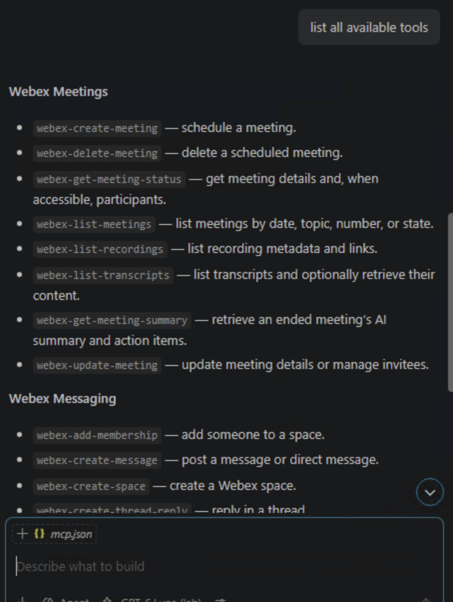

# Lab 2 - Connect the AI Client and Discover Tools

!!! note "Time: 25-45 min"
    Inspect the connected MCP tools, discover their capabilities, and test them hands-on.

## Section 1 - Verify your connection

1. Open **LAB-11161** in VS Code and the Chat panel on the right. At the bottom of the chat input, select **Agent** if needed, choose **GPT-6 Luna (lab)**, and confirm **Local** appears below it. Agent mode can plan and call MCP tools; a plain chat mode may only answer from text. Keep the default permission controls and review write calls individually.
2. Press **Ctrl+Shift+P**, run **MCP: List Servers**, and confirm `webex-meeting` and `webex-messaging` say **Running**. If one is stopped, select it and start it with the matching Lab 1 token.
3. In Copilot Chat, click the **slider icon beside the model name**. Its tooltip says **Configure Tools**. Confirm the two Webex servers' tools are enabled. This controls what the chat can offer; Control Hub policy is the separate organization-level boundary.

## Section 2 - Discover tools

4. Ask the agent to **list all available tools** without executing any write action.
5. Inspect the schemas for these key tools:

    - `webex-list-meetings`
    - `webex-list-transcripts`
    - `webex-get-meeting-summary`
    - `webex-create-space`
    - `webex-create-message`
    - `webex-create-meeting`

6. Ask the agent to explain which tools are **read-only** and which have **side effects**.

!!! blank "Try this prompt"
    <copy>List the Webex Meetings and Messaging tools available in this chat. Group them into read-only and write actions. Do not call any write tool. Show the required inputs for the tools we will use in this lab.</copy>

A tool list may look like this. Your enabled set should reflect the 8 Meeting tools and 9 Messaging tools allowed in Lab 1.

## Section 3 - Tool-selection challenge

Before running each request below, pause and predict in your head which MCP server and tool the agent should use. Enter the request in Copilot Chat in VS Code, then compare your prediction with the tool call shown there. You do not need to type an answer into this guide.

- Find the two Wayfinder Mission meetings.
- Find spaces with "MCP" in the title.
- Create a new Webex space.

After each request, ask yourself:

- Did the agent choose the tool you expected?
- What required inputs did the tool need?
- Was the operation read-only or side-effecting?
- Did Copilot Chat request approval?

!!! curious "Why this matters"
    Agents choose tools based on their names, descriptions, and schemas. Understanding that decision helps you diagnose incorrect tool selection and design better prompts.

## Section 4 - Warm-up: test your tools

Now that you know what tools are available, try them out and watch the results in real time.

### Preparation

7. Open the **Webex** desktop application on your lab workstation and sign in with the **Webex App user** from **Session_Info.txt**. Keep it visible alongside VS Code so you can watch changes happen in real time.

!!! important "Tool approval"
    Keep Copilot Chat on manual permissions. When a tool call requires approval, expand its details, review the exact inputs, and approve it for this use only. If a write call runs without a prompt, check **Chat: Manage Tool Approval** before continuing the approval experiment.

### Try these tasks

Ask the agent to do each of the following. Watch the results appear in the Webex desktop app as the agent executes each tool.

8. **Create a space** - Ask the agent to create a Webex space with a fun name (for example `MCP Launch Pad` or `My First MCP Space`).
9. **Post a message** - Ask the agent to post a message in the new space (for example "Hello from MCP! This message was sent by an AI agent."). Switch to Webex and confirm the message appears.
10. **Add a member** - Ask the agent to add a second lab account to the space. Use **aperez@<your pod domain>**: read the exact domain from the `Domain` line in **Session_Info.txt** and replace the placeholder. Do not use the example domain from a screenshot. Review that email in the membership tool call before approving, then watch the notification appear in Webex.
11. **Find the Wayfinder meetings** - Ask for both **Wayfinder Mission - Daily Brief** and **Wayfinder Mission - New Images Review**. Search September 29–October 7, 2026 in UTC date windows **including all meeting states**, rather than only `ended` meetings. Split the range into smaller windows if the tool requires it. Confirm the exact titles and meeting IDs came from the Meetings MCP server.

!!! blank "If a simple recent-meetings prompt returns nothing"
    <copy>Use the Webex Meetings MCP server to find meetings with "Wayfinder Mission" in the title from September 29 through October 7, 2026. Search in UTC date windows, splitting the range if needed, and include all meeting states. Show the exact title, start time with timezone, state, and meeting ID for each match. Do not guess an ID.</copy>

The lab recordings may appear under a state such as `missed` even though their recording and transcript exist. A narrow `ended` filter or a date range ending before the UTC recording date can hide them. If neither title appears, confirm the Webex account from **Session_Info.txt** and ask a proctor.

!!! webex "What you should see"
    By the end of the warm-up you should have a Webex space with a message in it, visible in the Webex desktop app. This confirms both MCP servers are working and the agent can read and write data on your behalf.

## Section 5 - Approval experiment

Compare how Copilot Chat handles a read operation and a write operation:

1. Ask the agent to list your Webex spaces. Review the tool call and approval behavior.
2. Ask the agent to post a second message in your warm-up space.
3. When Copilot Chat asks for approval, decline the tool call.
4. Confirm no message appeared in Webex.
5. Revise the message, run the request again, review the exact tool inputs, and approve it.
6. Confirm only the approved message appears.

!!! blank "Try this prompt after rejecting the first message"
    <copy>Post this revised message in my MCP warm-up space: "I reviewed and approved this message before the agent posted it."</copy>

!!! important
    A **read** tool fetches information and usually does not need the same approval as a **write** tool. A write tool changes Webex state: it can create a space, add a member, or publish a message. VS Code may still ask for permission on a read call depending on its settings. For a write, inspect the target and content, then approve only the exact action you intend. Control Hub can hide a tool entirely; chat approval governs an available tool call.

## Section 6 - Identify what each Wayfinder meeting is for

12. Use `webex-list-meetings` or the prompt above to locate both exact titles. **Wayfinder Mission - Daily Brief** has the follow-up transcript for Lab 3. **Wayfinder Mission - New Images Review** has the quality issue for Lab 4 and the capstone.
13. Record which title maps to each exercise. Let the tool return the meeting IDs; never construct an ID from a title.

## Checkpoint

You are ready for Lab 3 when:

- [x] Both MCP servers are running and their tools are enabled in Copilot Chat
- [x] You can list and describe the available MCP tools
- [x] You created a Webex space and posted a message using the agent
- [x] You can see the space and message in the Webex desktop app
- [x] You predicted and verified which tools the agent selected
- [x] You rejected, revised, and approved a write operation
- [x] You found both Wayfinder meetings and know which one each later lab uses
