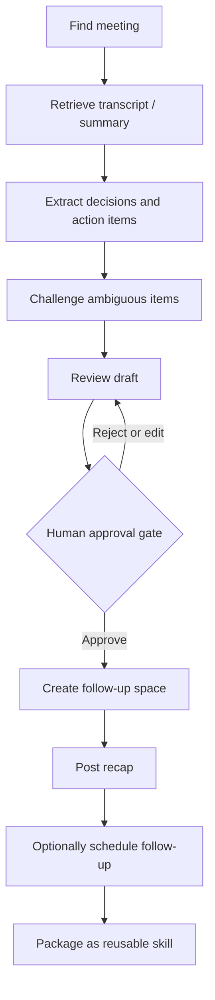

# Lab 3 - Build the Meeting Follow-Up Assistant

!!! note "Time: 55-95 min"
    Walk through a complete meeting follow-up workflow by prompting the agent step-by-step, then package the workflow into a reusable skill file.

## Workflow overview

---

## Phase 1 - Interactive follow-up workflow

In this phase you will prompt the agent to complete each step of a meeting follow-up. You are driving the workflow - the agent executes tools on your behalf.

### 3.1 Find the meeting

!!! blank "Prompt the agent"
    <copy>Find my recent meeting with "LAB-FOLLOWUP" in the title. Show me the title, date, and participants.</copy>

- If multiple meetings match, the agent should show candidates and ask you to pick one.

### 3.2 Retrieve the transcript or summary

!!! blank "Prompt the agent"
    <copy>Get the transcript and summary for that meeting. Show me a brief overview of what was discussed.</copy>

- Note whether it retrieved a transcript, a summary, or both.

### 3.3 Extract decisions and action items

!!! blank "Prompt the agent"
    <copy>From that meeting transcript, extract all decisions made and action items assigned. For each action item, include: who owns it, when it's due, and a short quote from the transcript as evidence.</copy>

- Review the output. Are the action items real or hallucinated?
- The **evidence** field is key - it lets you distinguish explicit commitments from LLM inferences.
- Ask follow-up questions if anything looks wrong.

### 3.4 Challenge an ambiguous action item

Choose one extracted action item whose owner, due date, or intent is unclear.

!!! blank "Prompt the agent"
    <copy>Recheck the transcript evidence for the most ambiguous action item. Tell me which parts are explicitly stated and which parts you inferred. If the owner or due date is not explicit, mark it as unassigned or not specified instead of guessing.</copy>

- Compare the revised item with the original extraction.
- Correct the agent if it treated a joke, suggestion, or unresolved discussion as a commitment.
- Confirm the final item includes only evidence-supported facts.

### 3.5 Review the draft before posting

!!! blank "Prompt the agent"
    <copy>Draft a follow-up message that includes the meeting summary, decisions, and action items. Show me exactly what you plan to post - do not post it yet. Formatting rules for the Webex message: Do NOT use markdown tables, Webex does not render them properly. Use bullet lists for action items. Use bold text and line breaks for meeting details, not tables. Use headings to separate sections. Keep emojis minimal and professional.</copy>

- Review the draft carefully. Is anything missing, incorrect, or inappropriate to share?
- Ask the agent to make edits if needed (for example, "Remove the second action item, that was a joke not a real commitment").

!!! important "Webex markdown"
    Webex supports bold, italic, headings, bullet lists, numbered lists, and links - but **not tables**. If the agent uses table syntax, it will appear as raw text. Guide the agent to use lists instead.

### 3.6 Create the follow-up space and post

!!! blank "Prompt the agent"
    <copy>The draft looks good. Create a Webex space called "LAB Follow-up — [meeting title]" and post that message.</copy>

- The agent should ask for your approval before creating the space and posting.
- Review the proposed action: space name, message content.
- Approve when ready.
- Switch to the **Webex desktop app** and confirm the space was created with the correct message.

### 3.7 Schedule a follow-up meeting

!!! blank "Prompt the agent"
    <copy>Was a follow-up meeting mentioned in the transcript? If so, what date, time, timezone, and attendees were specified? If all details are explicit, propose scheduling it. If anything is ambiguous, ask me to clarify.</copy>

- The agent should **not** invent a time from vague phrases like "next week."
- If details are missing, it should ask you - not guess.

---

## Phase 2 - Build a reusable skill

Now that you have completed the workflow manually, turn it into a reusable skill file that the agent can follow automatically for future meetings.

### 3.8 Create the skill file

!!! blank "Prompt the agent"
    <copy>Based on the workflow we just completed, create a VS Code Agent Skill at `.github/skills/meeting-follow-up/SKILL.md` that captures this entire follow-up process. Include YAML frontmatter with `name: meeting-follow-up` and a description of when to use it. The skill should: find a meeting by title or ID; retrieve the transcript/summary; extract decisions and action items with evidence; create a follow-up space and post the recap (with approval); schedule a follow-up meeting only when the required details are explicit. Require human approval before any write action. Format output as structured sections.</copy>

- Review the generated skill file.
- Does it capture the workflow you just did?
- Does it include the approval gate?

### 3.9 Refine the skill

Customize one visible behavior without weakening its safety rules.

!!! blank "Prompt the agent"
    <copy>Update the meeting-follow-up skill so follow-up spaces use the name "Customer Follow-Up — [meeting title]". Format action items as bullet points with bold owner names. Keep all approval and evidence requirements unchanged.</copy>

- Review the change in `.github/skills/meeting-follow-up/SKILL.md`.
- Confirm the skill still requires evidence and human approval.
- This demonstrates the boundary between customizable presentation and non-negotiable safety behavior.

### 3.10 Test the skill on a new meeting

Start a **new local Copilot Chat session** in VS Code so the agent has no prior context from the steps above. Confirm the skill appears under **Configure Skills** (or type `/` in chat to find it).

!!! blank "Prompt the agent (new session)"
    <copy>Run the meeting-follow-up skill. List my recent meetings and let me pick which one to create a follow-up for.</copy>

- The agent should use the skill file to guide its workflow - not rely on previous conversation history.
- Pick a **different** meeting than the one you used above.
- Walk through the approval steps as prompted.
- Confirm the follow-up space and recap are created successfully.

!!! webex "What this proves"
    The skill works as a standalone, reusable workflow. The agent discovers the meeting, extracts content, drafts a recap, gets your approval, and posts - all guided by the skill file, not your step-by-step prompts.

---

## Checkpoint

You are ready for Lab 4 when:

- [x] You interactively completed a full meeting follow-up workflow
- [x] You corrected an ambiguous or unsupported extraction
- [x] The agent created a follow-up space with a reviewed recap (with your approval)
- [x] You built a reusable skill file that captures the workflow
- [x] You customized the skill without weakening its safety rules
- [x] The skill was tested and produced a consistent result
- [x] No transcript or credentials were exposed unnecessarily
