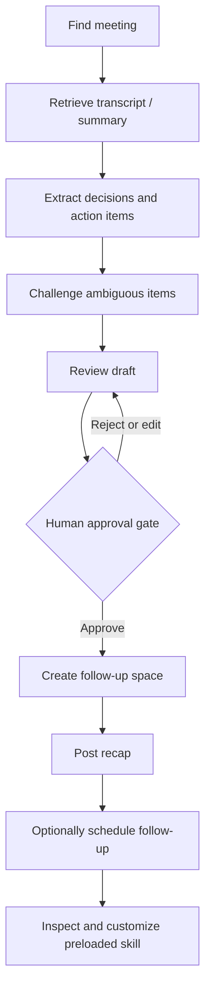

# Lab 3 - Use and Customize the Meeting Follow-Up Assistant

!!! note "Time: 45-75 min"
    Walk through a complete meeting follow-up workflow step by step, then inspect and customize the reusable skill already in your workspace.

## Workflow overview

---

## Phase 1 - Interactive follow-up workflow

In this phase you will prompt the agent to complete each step of a meeting follow-up. You are driving the workflow - the agent executes tools on your behalf.

### 3.1 Find the meeting

!!! blank "Prompt the agent"
    <copy>Find the meeting titled "Wayfinder Mission - Daily Brief" between September 29 and October 7, 2026. Search in UTC date windows and include all meeting states. Show its exact title, date, participants, and meeting ID from the Webex Meetings MCP server.</copy>

- If multiple meetings match, compare the exact title and recording date. Choose the **Daily Brief** with a transcript; do not use the separate **New Images Review** yet.

### 3.2 Retrieve the transcript or summary

!!! blank "Prompt the agent"
    <copy>Get the transcript and summary for that meeting. Show me a brief overview of what was discussed.</copy>

- Note whether it retrieved a transcript, a summary, or both.

### 3.3 Extract decisions and action items

!!! blank "Prompt the agent"
    <copy>From that meeting transcript, extract all decisions made and action items assigned. For each action item, include: who owns it, when it's due, and a short quote from the transcript as evidence.</copy>

- Review the output. Are the action items real or hallucinated?
- The **evidence** field is key - it lets you distinguish explicit commitments from LLM inferences.
- Ask follow-up questions if anything looks wrong.

### 3.4 Challenge an ambiguous action item

Choose one extracted action item whose owner, due date, or intent is unclear.

!!! blank "Prompt the agent"
    <copy>Recheck the transcript evidence for the most ambiguous action item. Tell me which parts are explicitly stated and which parts you inferred. If the owner or due date is not explicit, mark it as unassigned or not specified instead of guessing.</copy>

- Compare the revised item with the original extraction.
- Correct the agent if it treated a joke, suggestion, or unresolved discussion as a commitment.
- Confirm the final item includes only evidence-supported facts.

### 3.5 Review the draft before posting

!!! blank "Prompt the agent"
    <copy>Draft a follow-up message that includes the meeting summary, decisions, and action items. Show me exactly what you plan to post - do not post it yet. Formatting rules for the Webex message: Do NOT use markdown tables, Webex does not render them properly. Use bullet lists for action items. Use bold text and line breaks for meeting details, not tables. Use headings to separate sections. Keep emojis minimal and professional.</copy>

- Review the draft carefully. Is anything missing, incorrect, or inappropriate to share?
- Ask the agent to make edits if needed (for example, "Remove the second action item, that was a joke not a real commitment").

!!! important "Webex markdown"
    Webex supports bold, italic, headings, bullet lists, numbered lists, and links - but **not tables**. If the agent uses table syntax, it will appear as raw text. Guide the agent to use lists instead.

### 3.6 Create the follow-up space and post

!!! blank "Prompt the agent"
    <copy>The draft looks good. Show me the exact space name "Wayfinder Mission - Daily Brief — Follow-Up", the recap, and the email addresses of the meeting participants you would add. Use participant details returned by Webex; do not guess an email. After I approve each action, create the space, add the other meeting participant, and post the reviewed recap.</copy>

- Check the proposed space name, recap, and membership list before approving. If Webex returned only names, use **aperez@<your pod domain>** for Anita, using the exact `Domain` line in **Session_Info.txt**. Confirm the account in the tool preview before adding it.
- Approve space creation, membership addition, and posting as separate write actions. Do not add a participant whose address you cannot verify.
- Switch to **Webex App** and confirm the new space, members, and message.

### 3.7 Schedule a follow-up meeting

!!! blank "Prompt the agent"
    <copy>Check the Daily Brief transcript for a follow-up meeting. State the date, time, timezone, duration, and attendees that are explicitly supported. The intended future slot for this lab is Monday, October 12, 2026 at 14:00 UTC with Charles and Anita. If the transcript differs, the date has passed, or the duration is missing, ask me to confirm the missing detail before proposing a meeting. Show the final invitation for approval before scheduling.</copy>

- Do not turn a vague phrase such as “next Monday” into a date without checking the calendar and current year.
- If the agent asks for a duration, confirm **30 minutes** for this lab before reviewing the invitation.
- An earlier recording may mention **October 7**. That date is already the lab day; do **not** schedule it. Tell a proctor so the recording can be refreshed.
- After approving a valid meeting, open **Webex App → Meetings** and confirm the scheduled meeting appears in the calendar with the correct time and invitees.

---

## Phase 2 - Learn from a preloaded reusable skill

The **LAB-11161** workspace already contains `.github/skills/meeting-follow-up/SKILL.md`. You did the workflow manually first so you can recognize what this reusable instruction captures. A skill guides agent behavior; Control Hub tool policy and your approval of writes still apply.

### 3.8 Inspect the skill that was used

1. In VS Code Explorer, expand **.github → skills → meeting-follow-up** and open `SKILL.md` plus its linked `references/workflow.md`.
2. Find the steps for meeting discovery, transcript evidence, ambiguous action items, draft review, membership, and approval.

!!! blank "Ask the agent to connect the work to the skill"
    <copy>Review the existing meeting-follow-up skill in this workspace. Map the steps I just completed to its instructions. Explain how I could turn another repeated tool workflow into a new skill. Do not overwrite this skill.</copy>

### 3.9 Customize one visible behavior

!!! blank "Prompt the agent"
    <copy>Update the existing meeting-follow-up skill so its default space title is "Follow-Up — [meeting title]" and action items use bullets with bold owner names. Keep transcript evidence, data-gap handling, and approval before every write action. Do not create a new skill directory.</copy>

- Review the changed `SKILL.md` and any referenced formatting file. Confirm it no longer asks for Markdown tables in Webex messages.
- This changes presentation while preserving the workflow's evidence and approval rules.

### 3.10 See the skill work without earlier chat context (if time allows)

Start a **new Local Agent chat** in VS Code. Check **Configure Skills** (or type `/` in chat) for `meeting-follow-up`.

!!! blank "Prompt the agent (new session)"
    <copy>Use the meeting-follow-up skill for "Wayfinder Mission - Daily Brief". Find the meeting and draft a new recap using the skill's current format. Stop before creating a space, adding members, scheduling, or posting anything.</copy>

- Check that the new draft follows your updated naming and bullet format without relying on the prior conversation.
- This is a draft-only check; it avoids creating a duplicate follow-up space. You will use both skills together in Lab 5.

---

## Checkpoint

You are ready for Lab 4 when:

- [x] You interactively completed a full meeting follow-up workflow
- [x] You corrected an ambiguous or unsupported extraction
- [x] The agent created a follow-up space with a reviewed recap (with your approval)
- [x] You reviewed and approved a follow-up meeting with a confirmed date, time, duration, and attendee list
- [x] You inspected the preloaded skill and connected it to the workflow you completed
- [x] You customized the skill without weakening its safety rules
- [x] No transcript or credentials were exposed unnecessarily
