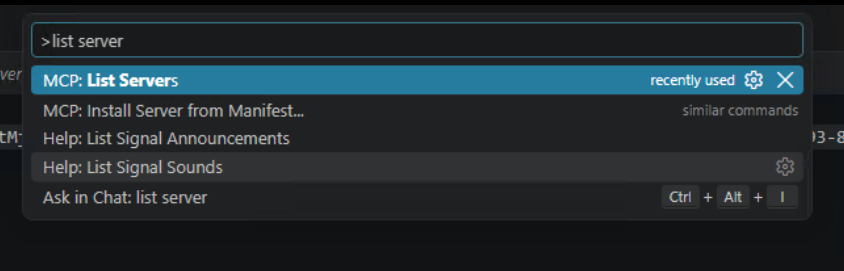
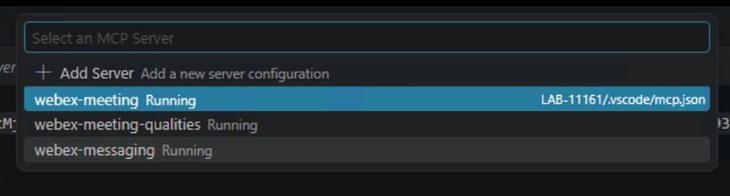

# Lab 4 - Use the Meeting Quality Assistant

!!! note "Time: 75-105 min"
    Start the prepared custom MCP server that wraps the Webex Meeting Qualities REST API, use it to troubleshoot a seeded meeting, then inspect the reusable skill already in your workspace.

!!! important "Architecture note"
    The official Webex Meetings MCP server provides meeting lifecycle and intelligence tools, but it does **not** expose media-quality telemetry. Quality data comes from a separate REST API.

    In this lab that API is wrapped by a **custom MCP server the lab provides** at `src/quality-tool/server.py` ([source]({{config.extra.quality_tool_url}}){:target="_blank"}). Your agent speaks MCP to it, and it speaks REST to Webex on your behalf. This is the pattern you will use whenever an agent needs data from a non-MCP source. See [MCP vs. REST API](reference/mcp-vs-rest.md).

---

## Phase 1 - Set up the quality MCP server

### 4.1 Generate a personal access token

The Meeting Qualities API requires the `analytics:read_all` scope and an org admin account. The simplest way to get a token with this scope is a personal access token.

1. Go to [developer.webex.com](https://developer.webex.com/){:target="_blank"} and sign in with the **Webex user** from **Session_Info.txt** on the pod desktop.
2. Click your **avatar** → **My Personal Access Token**.
3. Copy the token. It is valid for 12 hours and includes all scopes for your account.

!!! important "Personal access tokens"
    Personal access tokens grant full access to your account. In production you would use a scoped OAuth integration instead. This is a lab shortcut. Never commit a token to version control.

### 4.2 Inspect and start the prepared server

The **LAB-11161** workspace already has `src/quality-tool/server.py`, its Python environment, and a `webex-meeting-qualities` entry in `.vscode/mcp.json`. VS Code starts the prepared server and prompts you for the token from step 4.1.

1. In VS Code Explorer, expand **src → quality-tool** and locate `server.py`. Expand **.vscode** and open `mcp.json` to see the preconfigured quality server.

2. Press **Ctrl+Shift+P** to open the Command Palette, type `MCP: List Servers`, and select it.

   

3. Select **webex-meeting-qualities** from the server list and choose **Start Server**. When VS Code asks for the **Webex Meeting Qualities developer token**, paste the personal access token from step 4.1 and press Enter. Paste only the token; do not include `Bearer`. The input is hidden. If the server is already running, continue to the next step.

   

4. From that server's menu select **Show Output**, or open **View → Output** and choose `MCP: webex-meeting-qualities`. Confirm **Connection state: Running**. In Copilot Chat, select the **Configure Tools** slider beside the model and confirm `get_meeting_qualities` is enabled.

!!! curious "Where the token goes"
    VS Code passes the token you enter to the local quality-server process as `WEBEX_DEVELOPER_TOKEN`. The server uses it when calling the Webex Meeting Qualities REST API over HTTPS. Keep the token out of chat messages and source files.

!!! curious "Notice the different transport"
    The official Webex MCP servers are remote `http` URLs. VS Code launches this quality server locally using `uv` and the `stdio` transport. Inspect the two forms in the prepared `.vscode/mcp.json` and read [MCP Transports](reference/mcp-transports.md) for the tradeoffs.

### 4.3 Know the API's limits

The server inherits the constraints of the underlying API. These matter during the exercise:

| Constraint | Value |
| ---------------- | ---------------- |
| `Data availability` | Roughly 10 minutes after a meeting starts |
| `Retention` | 7 days |
| `Rate limit` | 1 request per 5 minutes per meeting instance ID |
| `Required scope` | `analytics:read_all` |
| `Required role` | Org admin, with Pro Pack licensing |

!!! important
    Because of the rate limit, do **not** let the agent retry a failed call in a loop. One call, then read the error.

---

## Phase 2 - Interactive quality troubleshooting

### 4.4 Find the target meeting

!!! blank "Prompt the agent"
    <copy>Find "Wayfinder Mission - New Images Review" seeded for this pod between September 29 and October 7, 2026. Search in UTC date windows and include all meeting states. Show its exact title, date, participants, and meeting ID from the Webex Meetings MCP server.</copy>

- Confirm it found **New Images Review**, rather than **Daily Brief**. The former has the intentionally degraded media stream.

### 4.5 Get quality data

!!! blank "Prompt the agent"
    <copy>Call get_meeting_qualities once for that meeting. Summarize the quality metrics for each participant and tell me which tool supplied the meeting details versus the quality data. Do not dump every raw sample into the chat.</copy>

- The agent should resolve the meeting ID from the Meetings MCP server, then pass it to `get_meeting_qualities`.
- Confirm it returns per-participant quality data.

### 4.6 Analyze the data

!!! blank "Prompt the agent"
    <copy>Analyze the quality data. Identify: which participants were affected by poor quality; when the degradation started and ended; which metrics were impacted (latency, jitter, packet loss); what direction (send/receive) and media type (audio/video/share). Separate your observations (what the data shows) from your hypotheses (what might have caused it). Include a confidence level for each conclusion. Note any data gaps.</copy>

- Does the output clearly separate facts from guesses?
- Are confidence levels reasonable?
- Does it acknowledge missing or incomplete data?

!!! curious "Read the data_gaps field"
    The server returns an explicit `data_gaps` list. Webex reports some metrics as empty arrays and others as `-1` placeholders meaning "not measured." The server flags both so the agent cannot mistake a missing measurement for a real value of zero.

### 4.7 Generate recommended checks

!!! blank "Prompt the agent"
    <copy>Based on your analysis, generate a list of recommended troubleshooting checks. Consider: client network, Wi-Fi, VPN, firewall, bandwidth, and endpoint issues. Link each recommendation back to a specific data observation.</copy>

- Good recommendations are grounded in the data, not generic checklists.

### 4.8 Practice failure handling (if time allows)

Test the server with an invalid meeting ID:

!!! blank "Prompt the agent"
    <copy>Call get_meeting_qualities with meetingId INVALID-LAB-MEETING-ID. Do not retry repeatedly. Explain the response and tell me what I should verify next.</copy>

The agent should:

- Report the failure instead of inventing quality data.
- Distinguish authentication failures (`401`/`403`) from missing or invalid meeting data (`404`).
- Avoid repeated calls because the API is rate-limited.
- Recommend checking the meeting instance ID, token validity, admin role, Pro Pack licensing, and the data-availability window.

!!! curious "The server never raises"
    `get_meeting_qualities` always returns the same shape with an `error` string set, rather than throwing. That gives the agent something structured to reason about instead of a stack trace.

### 4.9 Review the incident summary

!!! blank "Prompt the agent"
    <copy>Draft a complete incident summary I can share with my network team. Include: meeting title and date; affected participants; timeline of degradation; key metrics with values; observations vs. hypotheses; recommended checks; data gaps; and which data came from MCP versus the quality server. Formatting rules for the Webex message: Do NOT use markdown tables, Webex does not render them properly. Use bullet lists and bold labels instead. Use headings to separate sections. Show me the draft - do not post it yet.</copy>

- Review the draft. Would you send this to your network team?
- Ask for edits if needed.

### 4.10 Create an Incident Mode space

Before pasting the prompt, read the exact `Domain` value in **Session_Info.txt** on your pod desktop. Replace `[Estelle email]` with `esteele@<your pod domain>` and `[Kyle email]` with `kmelby@<your pod domain>`. Do not leave the placeholders in the prompt.

!!! blank "Prompt the agent"
    <copy>The summary looks good. Show me a restricted Webex space named "INCIDENT — Wayfinder Mission - New Images Review — [date]" and its member list before creating it. Add [Estelle email] and [Kyle email] as the incident responders. After I approve each write, create the space, add those members, and post the reviewed incident summary.</copy>

- Review the exact responder emails and domain before approval. Do not copy a domain from someone else’s pod.
- Approve the space, two memberships, and message as separate write actions. Then switch to Webex App to confirm the restricted space, members, and summary.

!!! important "Privacy"
    Do not expose full participant quality records to a broad space by default. Use aggregated findings and a restricted responder space unless your organization explicitly permits detailed sharing.

### 4.11 Post a follow-up update (if time allows)

!!! blank "Prompt the agent"
    <copy>Post a reply in the incident space: "Investigating the outbound packet loss observed for the affected participant. Checking the local network path and will report back with findings."</copy>

- Confirm the reply appears as a thread reply in Webex, not a new top-level message.

---

## Phase 3 - Review the preloaded quality skill

### 4.12 Inspect the reusable workflow

The workspace already contains `.github/skills/meeting-quality/SKILL.md` and `.github/skills/incident-mode/SKILL.md`. In VS Code Explorer, open both. Find where the skills require meeting ID lookup, evidence-backed metrics, separate observations and hypotheses, `data_gaps`, restricted membership, and approval before writes.

!!! blank "Ask the agent to explain skill creation"
    <copy>Review the existing meeting-quality and incident-mode skills in this workspace. Map their instructions to the workflow I just completed. Explain how an agent could create a similar new skill from a repeated tool workflow if the skill did not already exist. Do not overwrite these files or call Webex tools.</copy>

- You are reviewing an existing reusable artifact rather than recreating it. The capstone will exercise both skills together.
- Confirm the skill treats the quality API as a separate data source and never turns unmeasured values into zero.

!!! webex "What this proves"
    A local MCP server can expose a REST API to an agent, while a skill captures the repeatable reasoning and review steps around that tool. The token remains outside the chat, and Webex write actions still require your approval.

---

## Checkpoint

You are ready for Lab 5 when:

- [x] The custom quality MCP server is running in VS Code and its tool is enabled in Copilot Chat
- [x] The agent retrieved and analyzed quality data for a meeting
- [x] Observations were separated from hypotheses with confidence levels
- [x] Unsupported claims were removed from the reviewed incident summary
- [x] The agent clearly attributed metadata to MCP and telemetry to the quality server
- [x] An incident space was created only after your approval
- [x] You inspected the preloaded quality and incident-mode skills and mapped them to this workflow
