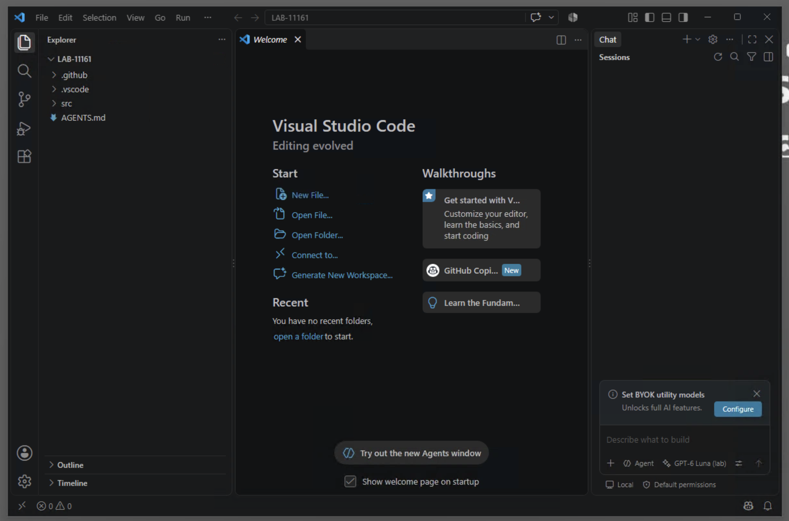

# Overview

## What you will build

In this lab you will govern Webex Agentic Apps, connect their MCP servers to a prepared VS Code agent, and use two practical meeting workflows.

!!! webex "1 - Meeting follow-up assistant"
    - Find a completed meeting and retrieve its transcript or summary.
    - Extract decisions and action items with supporting evidence.
    - Request human approval before creating spaces or posting messages.
    - Create a follow-up Webex space with a structured recap.
    - Optionally translate the output and generate an attendance report.

!!! webex "2 - Meeting quality troubleshooting assistant"
    - Find a target meeting through the official Meetings MCP server.
    - Call a **custom MCP server** that wraps the Webex Meeting Qualities REST API.
    - Identify affected participants and degradation windows.
    - Generate an incident summary and recommended checks.
    - Enter **Incident Mode** - a dedicated coordination space created only after approval.

The workspace already contains reusable skills. You will inspect and customize them after completing each workflow, then coordinate them from a single business request in the capstone.

## Learning Objectives

By the end of this lab, you will be able to:

- Explain the difference between an MCP server, an MCP client, a tool, and a REST API.
- Enable and govern official Webex Agentic Apps in Control Hub.
- Connect an AI client to Webex Meetings and Messaging MCP servers.
- Discover tools and inspect their required inputs and outputs.
- Use meeting and messaging tools safely with least privilege and human approval.
- Extend an agent with a custom MCP server backed by a Webex REST API.
- Customize agent skill files to match your organization's workflow.
- Coordinate multiple skills, MCP tools, and a REST API from one business request.

## Disclaimer

Although the lab design and configuration examples could be used as a reference, for design related questions for your production enrionments please contact your representative at Cisco, or a Cisco partner.

The Webex MCP servers, tool names, OAuth scopes, and client behavior shown in this guide reflect the versions validated for this event. Revalidate against the current Webex documentation before applying anything here to your own organization.

## Lab Access

Your pod is a Cisco dCloud Windows desktop with Webex App, a browser, and a prepared **LAB-11161** VS Code workspace. You do not need to install software or create the MCP configuration.

1. Open the [WebexOne dCloud Expo lab](https://www.ciscodcloud.com/apps/expo/d2zg6fntqau7tl8gb5r6ucoc6){:target="_blank"} from your own computer.
2. Enter your email address and accept the lab terms. Expo assigns your session ID; keep it available if you need a proctor's help.
3. Select **Open** to launch the browser-based RDP session for **wkst1**, using the Windows user **cholland**.
4. On the lab desktop, open **Session_Info.txt**. It contains the Control Hub and Webex App sign-in details for this pod. Use those details only inside this lab desktop.
5. Open this guide again in the browser **inside the dCloud desktop** so its prompts can be copied into VS Code.

If Expo access or sign-in fails, give your session ID to a proctor. Do not enter lab account passwords into this guide.

## Getting Started

### What you should know

Basic familiarity with Webex meetings and spaces, JSON data structures, and HTTP APIs (request/response concepts).

No prior MCP experience is required - the lab will teach you.

### Your first five minutes

1. Confirm you are in the **wkst1** browser desktop as **cholland** and note your Expo session ID.
2. Open **Session_Info.txt** on the desktop and locate the separate Control Hub and Webex App account details.
3. Open this guide in the pod's browser so you can copy prompts into VS Code.
4. Open **Visual Studio Code** from the desktop shortcut. The **LAB-11161** folder should already be open with `.github`, `.vscode`, `src`, and `AGENTS.md` visible in Explorer. The chat panel should offer **Agent**, **GPT-6 Luna (lab)**, and **Local**. You will start the Webex MCP servers in Lab 1.

## Lab Rules

!!! warning "Use only the lab environment"
    Work only with the lab organization and seeded data provided. Do not connect to your production Webex organization.

1. **Review before approving.** Keep Copilot Chat on manual tool approvals, review the tool name and inputs, and approve only the actions you intend.
2. **Don't trust output blindly.** AI-generated summaries and recommendations may be incomplete or incorrect. Verify before acting on them.

## Lab Flow and Timing

This instructor-led session is **120 minutes (2 hours)**. Keep the core path moving; sections marked **if time allows** can be completed after the session. Never rush through a Webex write approval to stay on schedule.

| Time | Module | What you do |
| ---: | ---------------- | ---------------- |
| 0-5 min | Orientation | Enter the dCloud pod and inspect the prepared workspace |
| 5-25 min | [Lab 1](lab1_control_hub.md) | Enable Agentic Apps, generate tokens, start prepared MCP servers |
| 25-45 min | [Lab 2](lab2_connect_discover.md) | Discover, predict, invoke, reject, and approve MCP tools |
| 45-75 min | [Lab 3](lab3_follow_up.md) | Complete a follow-up and customize its preloaded skill |
| 75-105 min | [Lab 4](lab4_quality.md) | Analyze quality data and inspect its preloaded skill |
| 105-115 min | [Lab 5](lab5_capstone.md) | Coordinate both skills in a cross-workflow capstone |
| 115-120 min | [Wrap-up](skills/customization-exercise.md) | Save your skill changes, complete the survey, and locate the take-home bundle |

!!! note
    This lab is designed as crawl, walk, run. Complete the core path first. Each lab marks its advanced exercises so that you can go deeper if you finish early.
