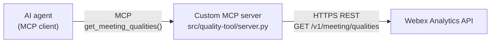

# MCP vs. REST API

A comparison of the two integration patterns used in this lab. The prepared quality MCP server calls the Webex REST API behind the scenes.

## Definitions

| Term | Definition |
| ---------------- | ---------------- |
| `REST API` | A conventional HTTP interface. You call a URL with a method, headers, and parameters, and get JSON back. Designed for developers writing code. |
| `MCP` | **Model Context Protocol.** An open standard that lets an AI agent discover and call tools at runtime, without those tools being hardcoded into the agent. Designed for models. |
| `MCP server` | A process that exposes one or more tools over MCP. It may wrap a REST API, a database, a filesystem, or anything else. |
| `MCP client` | The component inside your AI application that connects to MCP servers, lists their tools, and invokes them. In this lab, GitHub Copilot Chat in VS Code. |
| `Tool` | A single callable operation exposed by an MCP server, with a name, a description, and a typed input schema the model can read. |

## Side-by-side

| | REST API | MCP |
| ---------------- | ---------------- | ---------------- |
| **Primary consumer** | A developer writing code | An AI agent at runtime |
| **Discovery** | Read the docs, then hardcode the call | Agent asks the server "what tools do you have?" |
| **Schema** | Described in docs or OpenAPI, enforced by your code | Sent to the model as part of the tool definition |
| **Auth** | Your code holds and sends the credential | Server holds the credential; the agent never sees it |
| **Adding a capability** | Write new code, redeploy the app | Enable a tool; the agent discovers it on reconnect |
| **Governance** | Enforced in your application logic | Enforced at the server and, for Cisco servers, in Control Hub |
| **Shape of output** | Whatever the API returns | Whatever the tool author chooses to normalize and return |

## How they relate in this lab

The same component is an MCP **server** on its left edge and a REST **client** on its right edge. That translation layer is where you add the value:

| The raw REST API gives you | Your MCP server adds |
| ---------------------------- | ---------------------------- |
| A verbose, deeply nested response | A normalized, flattened shape the model can reason over |
| Empty arrays and undocumented `-1` sentinels | Explicit `data_gaps` entries so the agent cannot mistake "not measured" for "measured as zero" |
| Raw HTTP status codes | Plain-language `error` strings the agent can act on |
| A credential you must handle | A credential that never leaves the server |
| Every field the API supports | Only the fields the workflow needs, reducing tokens and accidental data exposure |

## The three servers in this lab

| Server | Who hosts it | Who governs it | You write code? |
| ---------------- | ---------------- | ---------------- | ---------------- |
| Webex Meetings MCP | Cisco | Control Hub | No |
| Webex Messaging MCP | Cisco | Control Hub | No |
| Meeting Qualities MCP | VS Code in your prepared pod | Your pod credential and local process | **No in this lab** - inspect [`quality-tool/server.py`]({{config.extra.quality_tool_url}}) |

!!! important "Why this matters operationally"
    Control Hub can only govern the official Cisco servers. Your custom MCP server is governed by *you* — its scope, its credential, and its read-only behavior are your responsibility. That is the tradeoff for being able to wrap any API you like.

## When to build a custom MCP server

Build one when:

- The capability you need is not exposed by an official MCP server (as with meeting-quality telemetry here).
- You want to normalize, filter, or redact a response before a model ever sees it.
- You need the credential to stay server-side.
- You want to constrain a broad API down to one narrow, read-only operation.

Do **not** build one when an official, governed server already does the job — you would be taking on hosting, credential rotation, and governance for no gain.

!!! note "Next: how the client reaches the server"
    This page covers *what* an MCP server wraps. [MCP Transports](mcp-transports.md) covers *how* your agent connects to one — stdio versus Streamable HTTP, and why this lab uses both.
