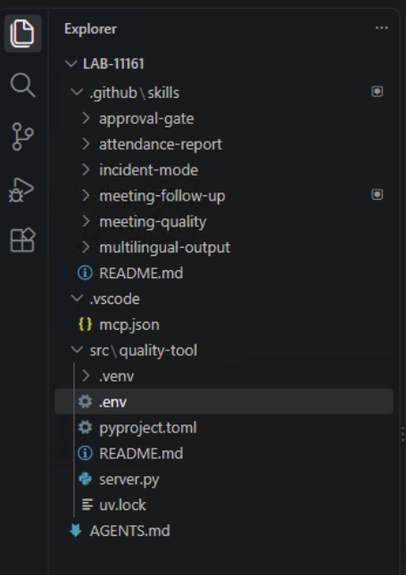

# Skill File Overview

## What is already in this workspace?

The prepared **LAB-11161** workspace includes six agent skills under `.github/skills/`. A skill is a reusable set of workflow instructions. It helps the agent choose steps and output formats, while Control Hub policy determines which Webex tools are available and you approve side effects.



| Skill | When it helps |
| --- | --- |
| `meeting-follow-up` | Turn a completed meeting transcript into a reviewed recap with evidence-backed actions |
| `meeting-quality` | Analyze per-participant quality telemetry and separate observations from hypotheses |
| `approval-gate` | Preview a Webex write action and request explicit approval |
| `incident-mode` | Coordinate a restricted quality incident space and updates |
| `attendance-report` | Report attendance without claiming unsupported engagement |
| `multilingual-output` | Translate a reviewed output while preserving names, dates, and evidence |

**Lab 3** covers the manual follow-up workflow and customization of `meeting-follow-up`. **Lab 4** uses the quality server, adds your own rule to `meeting-quality`, and inspects `incident-mode`. **Lab 5** checks whether both edits shape the agent's response to one business request.

## How skills are arranged

`AGENTS.md` at the workspace root provides general lab instructions. Each skill directory contains a `SKILL.md` with a name and description. Some skills link to a `references/` directory for the detailed workflow or output format.

```text
LAB-11161/
├── AGENTS.md
├── .github/
│   └── skills/
│       ├── approval-gate/
│       ├── attendance-report/
│       ├── incident-mode/
│       ├── meeting-follow-up/
│       ├── meeting-quality/
│       └── multilingual-output/
├── .vscode/mcp.json
└── src/quality-tool/
```

Open **Configure Skills** in Copilot Chat, or type `/` in the chat input, to see the discovered skills. The agent may load a skill when your request matches its description. Ask it which skill it used and inspect the tool calls; a good final answer alone does not prove the intended skill or data source was used.

## What can you customize?

You can change section names, action-item labels, space naming, report formatting, terminology, and troubleshooting checks. Keep transcript evidence, missing-data handling, private-data limits, and approval before Webex writes.

!!! important "Skills guide behavior"
    A skill file is not an enforcement boundary. Control Hub can disable Webex tools, and VS Code asks you to review tool calls. If a skill or response proposes an unreviewed write, stop and correct it.
