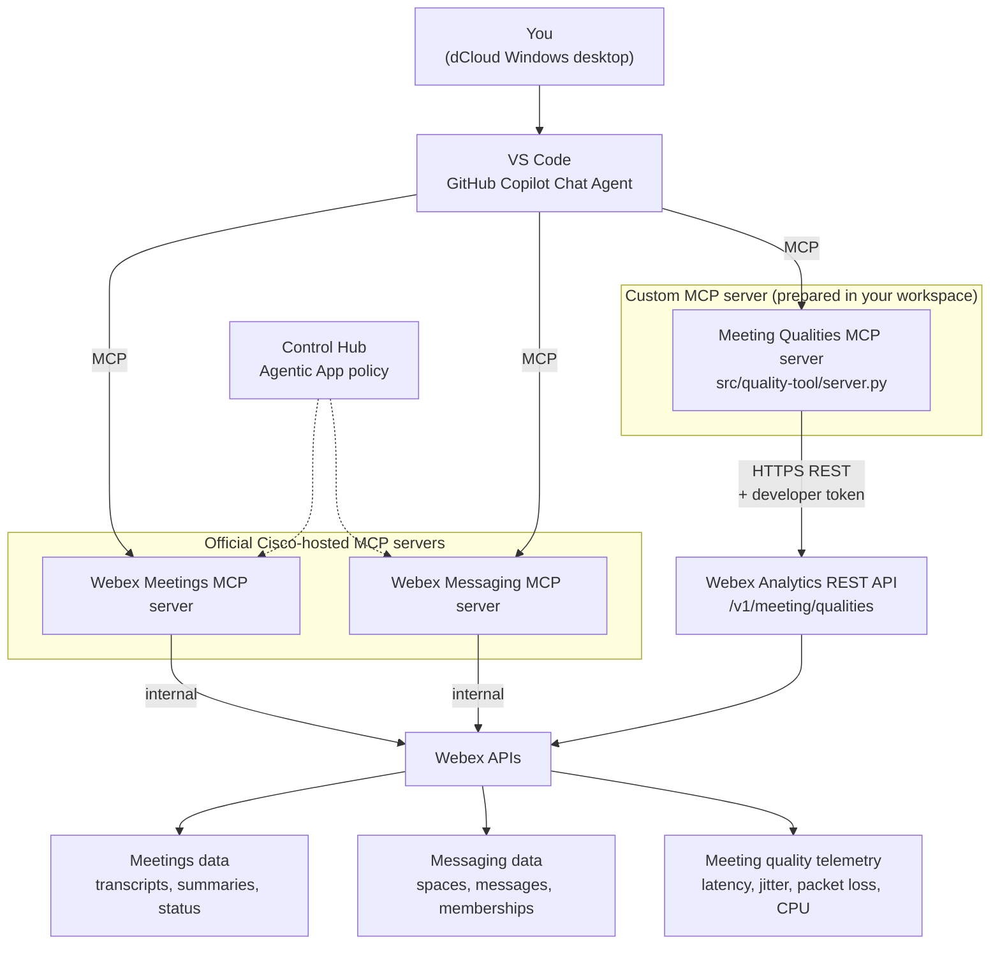

# Lab topologies

## Logical architecture

Every tool the agent calls is reached over **MCP**. The difference is what sits behind each server: the two official servers are Cisco-hosted and governed by Control Hub, while VS Code runs the prepared quality server locally, and it translates your MCP call into a Webex REST API call.

!!! important "Two hops, not one"
    Your agent never speaks REST. It speaks MCP to `src/quality-tool/server.py`, and *that server* speaks REST to Webex on your behalf — which is exactly why your developer token stays server-side and never reaches the agent or the model.

## Component responsibilities

| Component | What it does |
| ---------------- | ---------------- |
| `Control Hub` | Enables Agentic Apps, controls access, and governs which tools are available |
| `AI agent (Copilot Chat in VS Code)` | Discovers MCP tools, plans the workflow, requests your approval when required, and renders results |
| `Meetings MCP server` | Official, Cisco-hosted. Provides meeting lifecycle, transcript, summary, recording, and scheduling tools |
| `Messaging MCP server` | Official, Cisco-hosted. Provides spaces, messages, memberships, webhooks, file, and thread tools |
| `Meeting Qualities MCP server` | Custom, local. A small prepared FastMCP server VS Code starts that wraps the Webex Meeting Qualities REST API and returns normalized telemetry |
| `Webex Analytics REST API` | The underlying `/v1/meeting/qualities` endpoint. Reached only by the custom MCP server, never by the agent directly |

## Your lab pod

Each attendee receives an isolated pod so that nothing you do can affect another attendee or a production organization.

| Component | Per-attendee resource |
| ---------------- | ---------------- |
| `Virtual desktop` | One resettable Windows 11 dCloud desktop with browser, Webex App, VS Code, and GitHub Copilot Chat |
| `Webex organization` | One isolated, non-production Webex test organization |
| `Lab identities` | Pre-created fictional users providing a host, meeting attendees, and incident responders |
| `Your identity` | One designated lab user used for Control Hub, Webex App, and MCP authorization |
| `Wayfinder meetings` | The completed Daily Brief and New Images Review meetings |
| `Output prefix` | A reserved space-name prefix for everything you create, to keep cleanup simple |

## Key concept: MCP and REST are different layers

A common misconception is that MCP and REST are competing choices. They are not — in this lab the custom quality server is **both**: an MCP server on the side facing your agent, and a REST client on the side facing Webex.

- **Official MCP servers** - Cisco hosts them, Control Hub governs them, and you connect and authorize them. You write no code.
- **Custom MCP server** - the lab provides it in your workspace. It exposes one narrow, read-only MCP tool and calls a traditional Webex REST API behind the scenes.

!!! important
    The agent should always know, and tell you, which tool returned which data. See [MCP vs. REST API](reference/mcp-vs-rest.md) for the full comparison.
